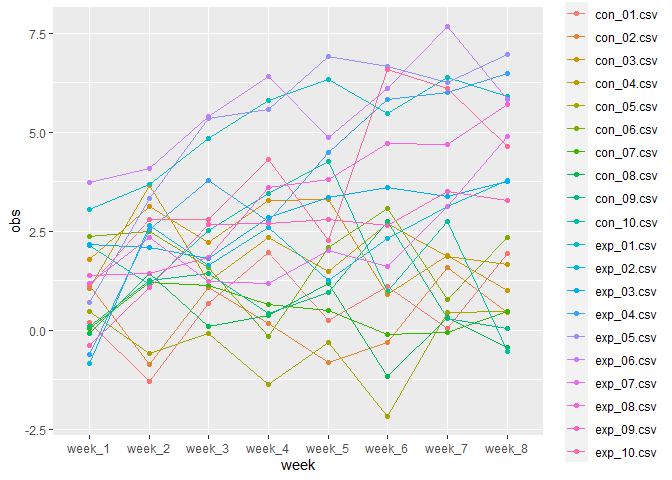
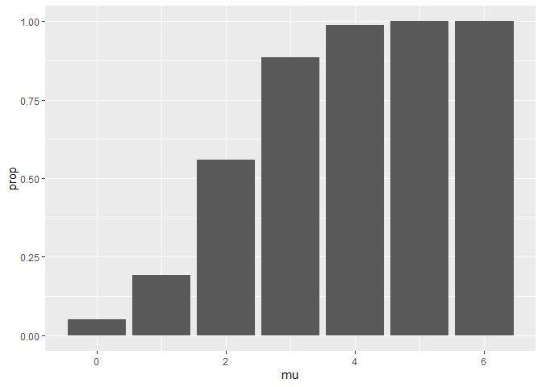
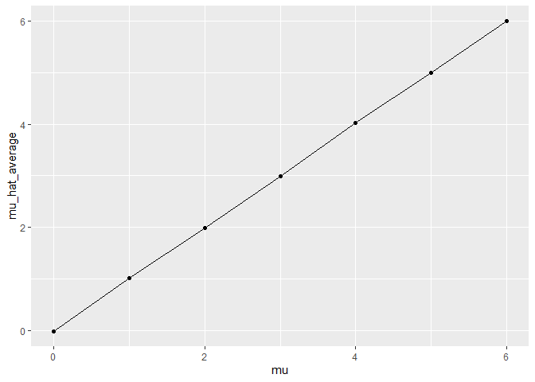
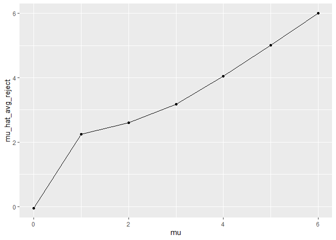

p8105_hw5_ncl2127
================
2023-11-06

``` r
library(tidyverse)
```

    ## ── Attaching core tidyverse packages ──────────────────────── tidyverse 2.0.0 ──
    ## ✔ dplyr     1.1.2     ✔ readr     2.1.4
    ## ✔ forcats   1.0.0     ✔ stringr   1.5.0
    ## ✔ ggplot2   3.4.3     ✔ tibble    3.2.1
    ## ✔ lubridate 1.9.2     ✔ tidyr     1.3.0
    ## ✔ purrr     1.0.2     
    ## ── Conflicts ────────────────────────────────────────── tidyverse_conflicts() ──
    ## ✖ dplyr::filter() masks stats::filter()
    ## ✖ dplyr::lag()    masks stats::lag()
    ## ℹ Use the conflicted package (<http://conflicted.r-lib.org/>) to force all conflicts to become errors

``` r
library(tidyr)
library(dplyr)
library(stringr)
library(ggplot2)
library(broom)
```

    ## Warning: package 'broom' was built under R version 4.3.2

Problem 1

``` r
hom_df <- read_csv("data/homicide-data.csv")
```

    ## Rows: 52179 Columns: 12
    ## ── Column specification ────────────────────────────────────────────────────────
    ## Delimiter: ","
    ## chr (9): uid, victim_last, victim_first, victim_race, victim_age, victim_sex...
    ## dbl (3): reported_date, lat, lon
    ## 
    ## ℹ Use `spec()` to retrieve the full column specification for this data.
    ## ℹ Specify the column types or set `show_col_types = FALSE` to quiet this message.

``` r
hom_df <- hom_df |>
  mutate(city_state = str_c(city, ', ', state))
 

open_hom <- hom_df |>
  filter(disposition %in% c("Open/No arrest", "Closed without arrest")) |>
    group_by(city_state) |>
  summarize(num_unsolved = n())

closed_hom <- hom_df |>
  filter(disposition == "Closed by arrest")|>
  group_by(city_state) |>
  summarize(num_solved = n())
```

``` r
blt_md_open <- open_hom |> filter(city_state == "Baltimore, MD")

blt_md_closed <- closed_hom |> filter(city_state == "Baltimore, MD")

# blt_md <- full_join(blt_md_open, blt_md_closed) |>
# mutate(total = blt_md$num_unsolved + blt_md$num_solved)
# 
# baltimore <- prop.test(blt_md$num_unsolved, blt_md$total) |> tidy(baltimore) |> select(estimate, conf.low, conf.high)
```

Problem 2

``` r
subject <- list.files(path = "C:/Users/ahsin/OneDrive/Desktop/p8105_hw5_ncl2127/data/hw5_data/data", full.names = FALSE, recursive = TRUE
)

setwd("C:/Users/ahsin/OneDrive/Desktop/p8105_hw5_ncl2127/data/hw5_data/data")

data_new <- tibble(subject) |>
  mutate(data = map(subject, read_csv))|>
  unnest() |>
  pivot_longer(week_1:week_8, names_to = "week", values_to = "obs")
```

    ## Rows: 1 Columns: 8
    ## ── Column specification ────────────────────────────────────────────────────────
    ## Delimiter: ","
    ## dbl (8): week_1, week_2, week_3, week_4, week_5, week_6, week_7, week_8
    ## 
    ## ℹ Use `spec()` to retrieve the full column specification for this data.
    ## ℹ Specify the column types or set `show_col_types = FALSE` to quiet this message.
    ## Rows: 1 Columns: 8
    ## ── Column specification ────────────────────────────────────────────────────────
    ## Delimiter: ","
    ## dbl (8): week_1, week_2, week_3, week_4, week_5, week_6, week_7, week_8
    ## 
    ## ℹ Use `spec()` to retrieve the full column specification for this data.
    ## ℹ Specify the column types or set `show_col_types = FALSE` to quiet this message.
    ## Rows: 1 Columns: 8
    ## ── Column specification ────────────────────────────────────────────────────────
    ## Delimiter: ","
    ## dbl (8): week_1, week_2, week_3, week_4, week_5, week_6, week_7, week_8
    ## 
    ## ℹ Use `spec()` to retrieve the full column specification for this data.
    ## ℹ Specify the column types or set `show_col_types = FALSE` to quiet this message.
    ## Rows: 1 Columns: 8
    ## ── Column specification ────────────────────────────────────────────────────────
    ## Delimiter: ","
    ## dbl (8): week_1, week_2, week_3, week_4, week_5, week_6, week_7, week_8
    ## 
    ## ℹ Use `spec()` to retrieve the full column specification for this data.
    ## ℹ Specify the column types or set `show_col_types = FALSE` to quiet this message.
    ## Rows: 1 Columns: 8
    ## ── Column specification ────────────────────────────────────────────────────────
    ## Delimiter: ","
    ## dbl (8): week_1, week_2, week_3, week_4, week_5, week_6, week_7, week_8
    ## 
    ## ℹ Use `spec()` to retrieve the full column specification for this data.
    ## ℹ Specify the column types or set `show_col_types = FALSE` to quiet this message.
    ## Rows: 1 Columns: 8
    ## ── Column specification ────────────────────────────────────────────────────────
    ## Delimiter: ","
    ## dbl (8): week_1, week_2, week_3, week_4, week_5, week_6, week_7, week_8
    ## 
    ## ℹ Use `spec()` to retrieve the full column specification for this data.
    ## ℹ Specify the column types or set `show_col_types = FALSE` to quiet this message.
    ## Rows: 1 Columns: 8
    ## ── Column specification ────────────────────────────────────────────────────────
    ## Delimiter: ","
    ## dbl (8): week_1, week_2, week_3, week_4, week_5, week_6, week_7, week_8
    ## 
    ## ℹ Use `spec()` to retrieve the full column specification for this data.
    ## ℹ Specify the column types or set `show_col_types = FALSE` to quiet this message.
    ## Rows: 1 Columns: 8
    ## ── Column specification ────────────────────────────────────────────────────────
    ## Delimiter: ","
    ## dbl (8): week_1, week_2, week_3, week_4, week_5, week_6, week_7, week_8
    ## 
    ## ℹ Use `spec()` to retrieve the full column specification for this data.
    ## ℹ Specify the column types or set `show_col_types = FALSE` to quiet this message.
    ## Rows: 1 Columns: 8
    ## ── Column specification ────────────────────────────────────────────────────────
    ## Delimiter: ","
    ## dbl (8): week_1, week_2, week_3, week_4, week_5, week_6, week_7, week_8
    ## 
    ## ℹ Use `spec()` to retrieve the full column specification for this data.
    ## ℹ Specify the column types or set `show_col_types = FALSE` to quiet this message.
    ## Rows: 1 Columns: 8
    ## ── Column specification ────────────────────────────────────────────────────────
    ## Delimiter: ","
    ## dbl (8): week_1, week_2, week_3, week_4, week_5, week_6, week_7, week_8
    ## 
    ## ℹ Use `spec()` to retrieve the full column specification for this data.
    ## ℹ Specify the column types or set `show_col_types = FALSE` to quiet this message.
    ## Rows: 1 Columns: 8
    ## ── Column specification ────────────────────────────────────────────────────────
    ## Delimiter: ","
    ## dbl (8): week_1, week_2, week_3, week_4, week_5, week_6, week_7, week_8
    ## 
    ## ℹ Use `spec()` to retrieve the full column specification for this data.
    ## ℹ Specify the column types or set `show_col_types = FALSE` to quiet this message.
    ## Rows: 1 Columns: 8
    ## ── Column specification ────────────────────────────────────────────────────────
    ## Delimiter: ","
    ## dbl (8): week_1, week_2, week_3, week_4, week_5, week_6, week_7, week_8
    ## 
    ## ℹ Use `spec()` to retrieve the full column specification for this data.
    ## ℹ Specify the column types or set `show_col_types = FALSE` to quiet this message.
    ## Rows: 1 Columns: 8
    ## ── Column specification ────────────────────────────────────────────────────────
    ## Delimiter: ","
    ## dbl (8): week_1, week_2, week_3, week_4, week_5, week_6, week_7, week_8
    ## 
    ## ℹ Use `spec()` to retrieve the full column specification for this data.
    ## ℹ Specify the column types or set `show_col_types = FALSE` to quiet this message.
    ## Rows: 1 Columns: 8
    ## ── Column specification ────────────────────────────────────────────────────────
    ## Delimiter: ","
    ## dbl (8): week_1, week_2, week_3, week_4, week_5, week_6, week_7, week_8
    ## 
    ## ℹ Use `spec()` to retrieve the full column specification for this data.
    ## ℹ Specify the column types or set `show_col_types = FALSE` to quiet this message.
    ## Rows: 1 Columns: 8
    ## ── Column specification ────────────────────────────────────────────────────────
    ## Delimiter: ","
    ## dbl (8): week_1, week_2, week_3, week_4, week_5, week_6, week_7, week_8
    ## 
    ## ℹ Use `spec()` to retrieve the full column specification for this data.
    ## ℹ Specify the column types or set `show_col_types = FALSE` to quiet this message.
    ## Rows: 1 Columns: 8
    ## ── Column specification ────────────────────────────────────────────────────────
    ## Delimiter: ","
    ## dbl (8): week_1, week_2, week_3, week_4, week_5, week_6, week_7, week_8
    ## 
    ## ℹ Use `spec()` to retrieve the full column specification for this data.
    ## ℹ Specify the column types or set `show_col_types = FALSE` to quiet this message.
    ## Rows: 1 Columns: 8
    ## ── Column specification ────────────────────────────────────────────────────────
    ## Delimiter: ","
    ## dbl (8): week_1, week_2, week_3, week_4, week_5, week_6, week_7, week_8
    ## 
    ## ℹ Use `spec()` to retrieve the full column specification for this data.
    ## ℹ Specify the column types or set `show_col_types = FALSE` to quiet this message.
    ## Rows: 1 Columns: 8
    ## ── Column specification ────────────────────────────────────────────────────────
    ## Delimiter: ","
    ## dbl (8): week_1, week_2, week_3, week_4, week_5, week_6, week_7, week_8
    ## 
    ## ℹ Use `spec()` to retrieve the full column specification for this data.
    ## ℹ Specify the column types or set `show_col_types = FALSE` to quiet this message.
    ## Rows: 1 Columns: 8
    ## ── Column specification ────────────────────────────────────────────────────────
    ## Delimiter: ","
    ## dbl (8): week_1, week_2, week_3, week_4, week_5, week_6, week_7, week_8
    ## 
    ## ℹ Use `spec()` to retrieve the full column specification for this data.
    ## ℹ Specify the column types or set `show_col_types = FALSE` to quiet this message.
    ## Rows: 1 Columns: 8
    ## ── Column specification ────────────────────────────────────────────────────────
    ## Delimiter: ","
    ## dbl (8): week_1, week_2, week_3, week_4, week_5, week_6, week_7, week_8
    ## 
    ## ℹ Use `spec()` to retrieve the full column specification for this data.
    ## ℹ Specify the column types or set `show_col_types = FALSE` to quiet this message.

    ## Warning: `cols` is now required when using `unnest()`.
    ## ℹ Please use `cols = c(data)`.

``` r
spaghetti <- ggplot(data_new, aes(x = week, y = obs, group = subject, color = subject)) + geom_point() + geom_line()

spaghetti
```

<!-- -->

Spaghetti Plot Comments:

The subjects from the experimental arm seem to have observation values
that increase at a higher rate than those of the subjects from the
control arm, as the plotted observations for exp_06, exp_07, exp_08,
exp_09, exp_10 started at values close to many of the control arm
subjects at increased at larger intervals and ending at values greater
than 2.5 by week 8. In fact, by week 8, it seems that all of the control
arm subjects’ observations stayed at their starting values or decreased
from their original values, all of which ended at less than 2.5 in week
8, while nearly all of the experimental arm subjects’ observations were
greater than 2.5 by week 8.

Problem 3

## P-value and Mean generation function (general)

``` r
alpha = 0.05

sim_mu_hat_p = function(n, mu, sigma = 5) {
  
  sim_data = tibble(
    x = rnorm(n = n, mean = mu, sd = sigma)
  )
  
  t_test = t.test(sim_data, mean = mu, conf.level = 1 - 0.05)|>
  broom::tidy()
}
```

## Case: Mu = 0

``` r
output_0 = vector("list", 5000)

for(i in 1:5000) {
  output_0[[i]] = sim_mu_hat_p(30, 0)
}

sim_results_0 = bind_rows(output_0)
```

## Case: Mu = 1

``` r
output_1 = vector("list", 5000)

for(i in 1:5000) {
  output_1[[i]] = sim_mu_hat_p(30, 1)
}

sim_results_1 = bind_rows(output_1)
```

## Case: Mu = 2

``` r
output_2 = vector("list", 5000)

for(i in 1:5000) {
  output_2[[i]] = sim_mu_hat_p(30, 2)
}

sim_results_2 = bind_rows(output_2)
```

## Case: Mu = 3

``` r
output_3 = vector("list", 5000)

for(i in 1:5000) {
  output_3[[i]] = sim_mu_hat_p(30, 3)
}

sim_results_3 = bind_rows(output_3)
```

## Case: Mu = 4

``` r
output_4 = vector("list", 5000)

for(i in 1:5000) {
  output_4[[i]] = sim_mu_hat_p(30, 4)
}

sim_results_4 = bind_rows(output_4)
```

## Case: Mu = 5

``` r
output_5 = vector("list", 5000)

for(i in 1:5000) {
  output_5[[i]] = sim_mu_hat_p(30, 5)
}

sim_results_5 = bind_rows(output_5)
```

## Case: Mu = 6

``` r
output_6 = vector("list", 5000)

for(i in 1:5000) {
  output_6[[i]] = sim_mu_hat_p(30, 6)
}

sim_results_6 = bind_rows(output_6)
```

## Plot showing proportion of times null rejected

``` r
cases = list(sim_results_0, sim_results_1, sim_results_2, sim_results_3, sim_results_4, sim_results_5, sim_results_6)

prop_finder = function(x) {
  prop_reject = nrow(filter(x, x$p.value <= 0.05)) / nrow(x)
}

props = tibble(prop = map(cases, prop_finder))

mu_cases <- c(0, 1, 2, 3, 4, 5, 6)

mu_props <- bind_cols(mu_cases, props)|>
  rename(mu = ...1)|>
  mutate(mu = as.numeric(unlist(mu)))|>
  mutate(prop = as.numeric(unlist(prop)))
```

    ## New names:
    ## • `` -> `...1`

``` r
reject_plot <- ggplot(mu_props, aes(x = mu, y = prop)) +geom_bar(stat = "identity")

reject_plot
```

<!-- -->

The power of the test increases as mu increases, so as the effect size
or difference between the null and alternative hypotheses increase, so
does the proportion of times the null mean was rejected.

## Plot showing average estimate of mu hat

``` r
mu_hat_avg_finder = function(x) {
  mu_hat = mean(x$estimate)
}

cases = list(sim_results_0, sim_results_1, sim_results_2, sim_results_3, sim_results_4, sim_results_5, sim_results_6)

mu_hats = tibble(mu_hat_average = map(cases, mu_hat_avg_finder))

mu_cases <- c(0, 1, 2, 3, 4, 5, 6)

mu_hat_avgs <- bind_cols(mu_cases, mu_hats)|>
  rename(mu = ...1)|>
  mutate(mu = as.numeric(unlist(mu)))|>
  mutate(mu_hat_average = as.numeric(unlist(mu_hat_average)))
```

    ## New names:
    ## • `` -> `...1`

``` r
mu_hat_avg_plot <- ggplot(mu_hat_avgs, aes(x = mu, y = mu_hat_average)) +geom_point() + geom_line()

mu_hat_avg_plot
```

<!-- -->

## Second plot showing average estimate of mu hat in samples where null was rejected

``` r
mu_hat_avg_reject_finder = function(x) {
  x <- filter(x, x$p.value <= 0.05)
  mu_hat = mean(x$estimate)
}

cases = list(sim_results_0, sim_results_1, sim_results_2, sim_results_3, sim_results_4, sim_results_5, sim_results_6)

mu_hats_reject = tibble(mu_hat_avg_reject = map(cases, mu_hat_avg_reject_finder))

mu_cases <- c(0, 1, 2, 3, 4, 5, 6)

mu_hat_avgs_reject <- bind_cols(mu_cases, mu_hats_reject)|>
  rename(mu = ...1)|>
  mutate(mu = as.numeric(unlist(mu)))|>
  mutate(mu_hat_avg_reject = as.numeric(unlist(mu_hat_avg_reject)))
```

    ## New names:
    ## • `` -> `...1`

``` r
mu_hat_avg_reject_plot <- ggplot(mu_hat_avgs_reject, aes(x = mu, y = mu_hat_avg_reject)) +geom_point() + geom_line()

mu_hat_avg_reject_plot
```

<!-- -->

For the most part, it seems that the sample average of mu hat where the
null is rejected is approximately equal to the true value of mu. There
seems a bit of a discrepancy when mu = 1, but otherwise, the average mu
hat matches the true mu. This makes sense because with all of the data
sets that used \[1, 6\] as its true mu to sample with, the null
hypothesis stating the true mu = 0, would be rejected. Since there were
5000 samples taken for each true mu between \[1, 6\], the average
estimate or mu hat should be approximately close to the true mu.
